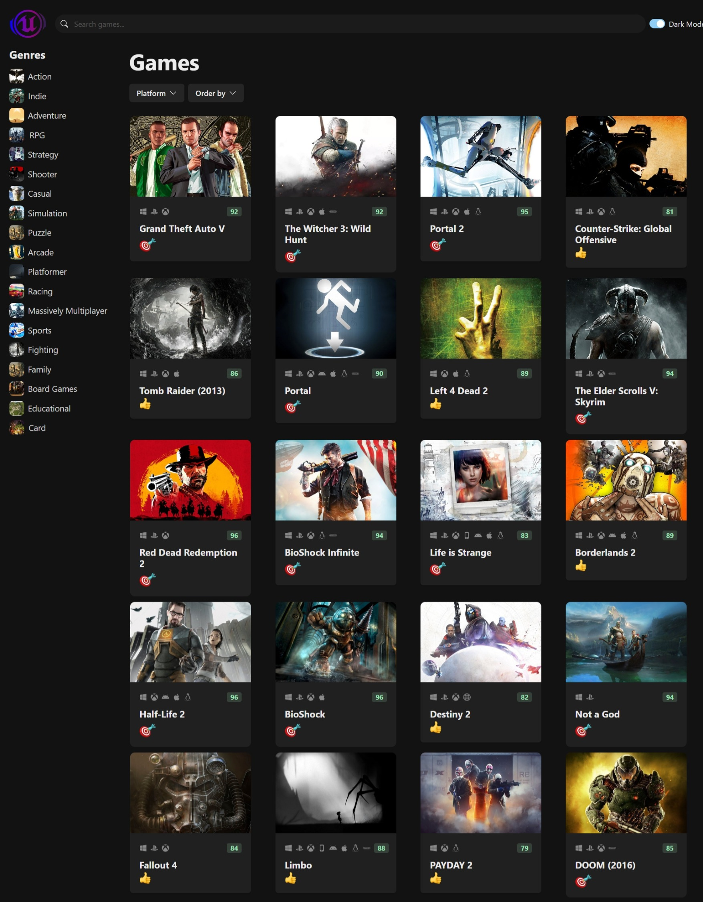

# React Game Store

## Overview

React-Game-Store is a dynamic website built using React, fetching data from an external API (RAWG.io) to display a variety of games. This project showcases modern front-end development techniques, including API integration, state management, and responsive design, offering users a smooth and interactive experience for discovering games.

The website is hosted on Vercel and can be accessed via the following link:

**[Live Website](https://main--engenme.netlify.app/)**

<div>
  
</div>

## Table of Contents

- Features
- Code Structure
- Prerequisites
- Installation
- Configuration
- Running the Application
- API Endpoints
- Technologies Used
- Contributing
- License

## Features

- Game Listing: Fetch and display games from an external API.
- Search Functionality: Search for games by name or keyword.
- Platform and Genre Filtering: Filter games based on genre and platform.
- Responsive Design: Mobile-first responsive layout.
- Dark Mode Toggle: Switch between light and dark modes.

## Code Structure

```bash
+---src
    |   App.css
    |   App.tsx
    |   index.css
    |   main.tsx
    |   theme.ts
    |   vite-env.d.ts
    |
    +---assets
    |       bulls-eye.webp
    |       logo.svg
    |       meh.webp
    |       placeholder.webp
    |       thumbs-up.webp
    |
    +---components
    |       ColorModeSwitch.tsx
    |       CriticScore.tsx
    |       Emoji.tsx
    |       GameCard.tsx
    |       GameCardContainer.tsx
    |       GameCardSkeleton.tsx
    |       GameGrid.tsx
    |       GameHeading.tsx
    |       GenreItemSkeleton.tsx
    |       GenreList.tsx
    |       NavBar.tsx
    |       PlatformIconList.tsx
    |       PlatformSelector.tsx
    |       RemoveAGameFromList.tsx
    |       SearchInput.tsx
    |       SortSelector.tsx
    |
    +---data
    |       genres.ts
    |       platforms.ts
    |
    +---hooks
    |       useData.ts
    |       useGames.ts
    |       useGenres.ts
    |       usePlatforms.ts
    |
    +---services
            api-client.ts
            image-url.ts
```

## Prerequisites

- Node.js v14 or higher
- npm or yarn
- Vite (if developing locally)
- An account on RAWG.io

### Installation

1. **Clone the Repository**

```bash
git clone https://github.com/EngenMe/React-Game-Store.git
cd React-Game-Store
```

2. **Install dependencies**

```bash
npm install
# or if you use yarn
yarn install
```

## Configuration

To access the game data, you'll need to create an account on [rawg.io](https://rawg.io/)
and obtain an API key.

## Running the Application

- Development Mode

```bash
npm run dev
# or if using yarn
yarn dev
```

This will start the development server and the app will be available at `http://localhost:{your-port}`

## Technologies Used

- Frontend: React, TypeScript
- State Management: React Hooks (with custom hooks)
- Styling: CSS Modules
- Build Tool: Vite
- API Integration: RAWG.io API (via custom api-client.ts)
- Utilities: Immer, Lodash

## Contributing

Feel free to fork the repository and submit pull requests for any improvements or bug fixes. Contributions are always welcome!

## License

This project is licensed under the MIT License - see the **`[LICENSE](LICENSE)`** file for details.
